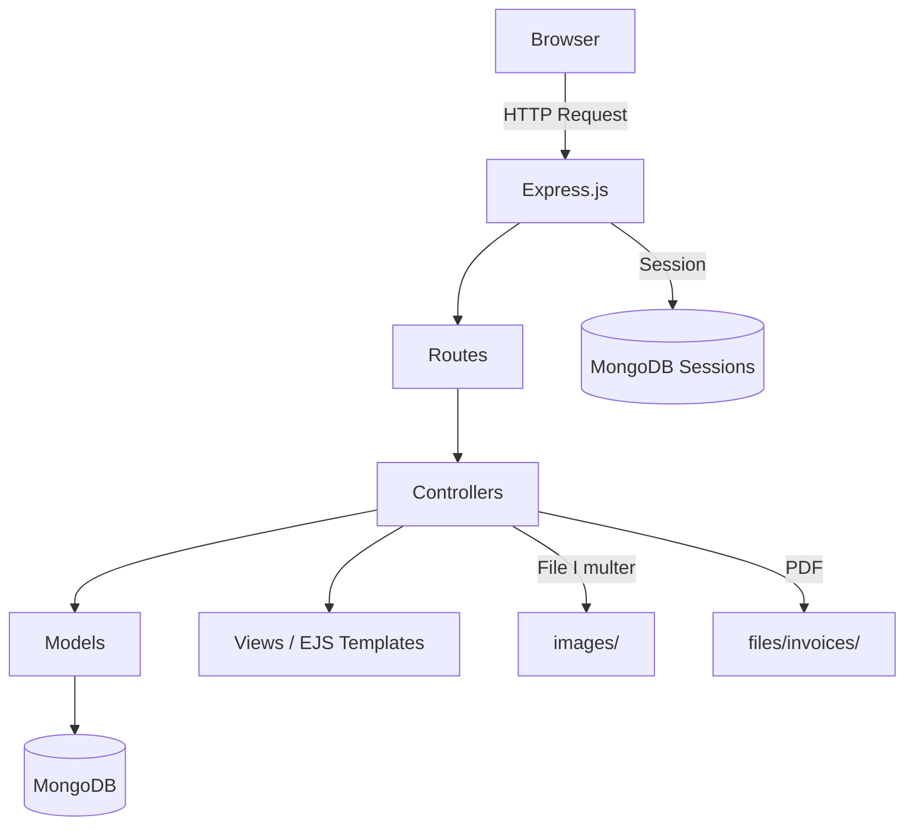

# NodeJS Shop

A full-featured application built with Node.js, Express.js, and MongoDB. This project implements a complete online shop with product management, shopping cart, order processing, PDF invoice generation, and Zarinpal payment gateway integration.

## Features

- **User Authentication** — Signup, login, logout with bcrypt password hashing
- **Password Reset** — Token-based password reset via email
- **Session Management** — Persistent sessions stored in MongoDB via `connect-mongodb-session`
- **Product Management** — CRUD operations for admin product management with image upload
- **Shopping Cart** — Add/remove products with per-user cart persistence
- **Order Processing** — Convert cart to order with product snapshot
- **Payment Gateway** — Zarinpal payment integration with verification callback
- **PDF Invoice Generation** — Downloadable PDF invoices per order via PDFKit
- **Image Upload** — Multer-based file upload with PNG/JPG/JPEG filtering
- **CSRF Protection** — csurf middleware on all state-changing requests
- **Server-Side Validation** — express-validator on auth and product forms
- **Flash Messages** — User feedback via connect-flash
- **Pagination** — Server-side product listing pagination
- **Responsive Navigation** — Mobile-friendly navigation with Tailwind CSS

## Tech Stack

| Layer | Technology |
|-------|-----------|
| Runtime | Node.js |
| Framework | Express.js 4.x |
| Database | MongoDB |
| ODM | Mongoose 6.x |
| Template Engine | EJS |
| Authentication | bcryptjs, express-session |
| Session Store | connect-mongodb-session |
| File Upload | Multer |
| Validation | express-validator |
| CSRF | csurf |
| PDF Generation | PDFKit |
| Payment | Zarinpal Checkout |
| Email | Nodemailer (Mailtrap) |
| CSS | Tailwind CSS |

## Architecture

This project follows the **MVC (Model-View-Controller)** pattern:



## Installation

### Prerequisites

- Node.js (v14 or higher)
- MongoDB (running instance)
- npm

### Steps

```bash
git clone https://github.com/tahadeh2010/nodejs-shop.git
cd nodejs-shop
npm install
```

### Configure Environment

Copy the example environment file and fill in your values:

```bash
cp .env.example .env
```

### Run

```bash
# Development (with nodemon)
npm run dev

# Production
node app.js
```

The server starts at `http://localhost:3000` by default.

## Environment Variables

| Variable | Description | Example |
|----------|-------------|---------|
| `PORT` | Server port | `3000` |
| `HOST` | Server hostname | `localhost` |
| `DATABASE_HOST` | MongoDB host and port | `localhost:27017` |
| `DATABASE_NAME` | MongoDB database name | `shop` |
| `SESSION_SECRET` | Secret for session encryption | `your-secret-key` |
| `SENDGRID_API_KEY` | SendGrid API key (for email) | `SG.xxxx` |
| `ZARINPAL_MERCHANT_ID` | Zarinpal merchant ID | `xxxxxxxx-xxxx-xxxx-xxxx-xxxxxxxxxxxx` |

## Project Structure

```text
├── app.js                  # Application entry point
├── controllers/            # Request handlers
│   ├── admin.js            # Admin product management
│   ├── auth.js             # Authentication logic
│   ├── error.js            # Error page rendering
│   └── shop.js             # Shop, cart, orders, payments
├── models/                 # Mongoose schemas
│   ├── order.js            # Order schema
│   ├── product.js          # Product schema
│   └── user.js             # User schema with cart methods
├── routes/                 # Express route definitions
│   ├── admin.js            # /admin/* routes
│   ├── auth.js             # Auth routes (login, signup, reset)
│   └── shop.js             # Shop routes (products, cart, orders)
├── middleware/              # Custom middleware
│   └── is-auth.js          # Authentication check
├── util/                   # Utility modules
│   ├── cookieparser.js     # Manual cookie parser
│   ├── email.js            # Nodemailer email sender
│   └── file.js             # File system helper (delete)
├── views/                  # EJS templates
│   ├── admin/              # Admin panel views
│   ├── auth/               # Auth views (login, signup, reset)
│   ├── includes/           # Shared partials (nav, head, layout)
│   ├── shop/               # Shop views (index, products, cart, etc.)
│   ├── 404.ejs             # Not found page
│   └── 500.ejs             # Server error page
├── public/                 # Static assets
│   ├── css/                # Stylesheets
│   ├── js/                 # Client-side JavaScript
│   └── images/             # Static images
├── images/                 # Uploaded product images
├── files/                  # Generated files
│   └── invoices/           # PDF invoices
├── .env.example            # Environment template
└── package.json
```

## Documentation

| Document | Description |
|----------|-------------|
| [Project Structure](docs/project-structure.md) | Directory responsibilities |
| [Architecture](docs/architecture.md) | System architecture and patterns |
| [Authentication](docs/authentication.md) | Auth flow and session management |
| [Database](docs/database.md) | Schemas, relationships, and indexes |
| [Request Flow](docs/request-flow.md) | Step-by-step user flows |
| [API Reference](docs/api-reference.md) | Complete route reference |
| [Environment](docs/environment.md) | Environment variable details |
| [Security](docs/security.md) | Security analysis and recommendations |
| [Deployment](docs/deployment.md) | Production deployment guide |
| [Developer Guide](docs/developer-guide.md) | Onboarding and development workflow |

## Future Improvements

- Add role-based access control (admin vs regular user)
- Implement rate limiting on auth routes
- Add input sanitization (DOMPurify for XSS prevention)
- Migrate session secret to a strong random value
- Add comprehensive test suite
- Implement product search and filtering
- Add product categories and tags
- Upgrade to MongoDB Atlas for production
- Add HTTPS and security headers (Helmet)
- Implement email via SendGrid (configured but using Mailtrap)
- Add product inventory tracking
- Implement order status management

## License

ISC
