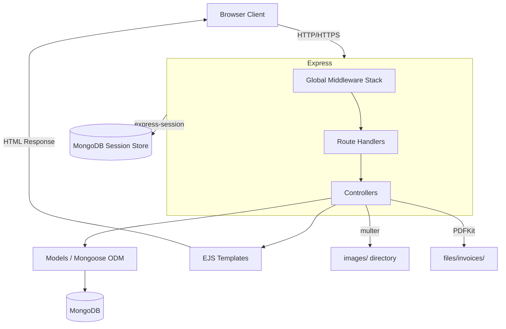
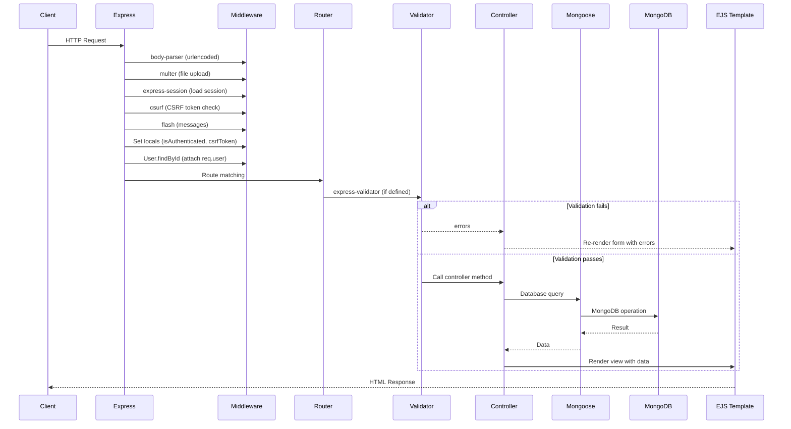
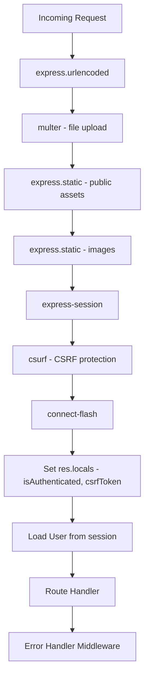
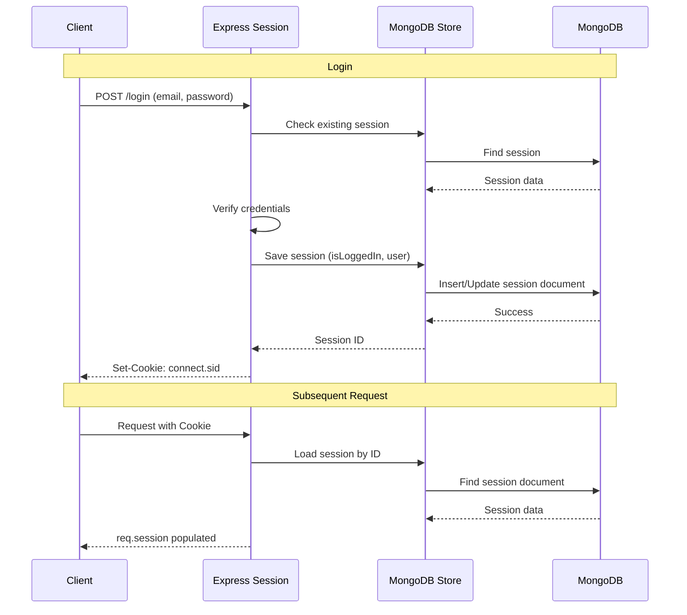
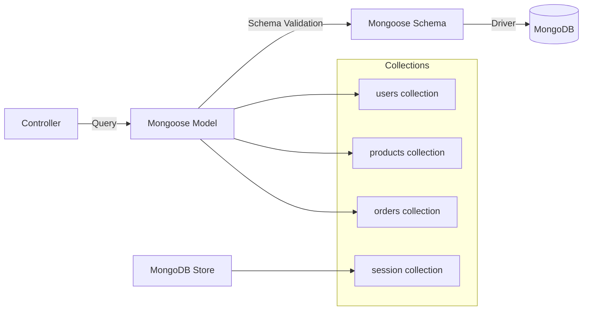
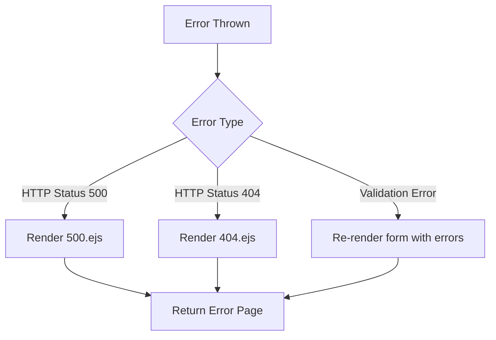
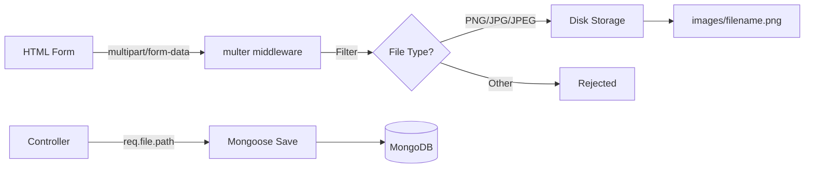

# Architecture

## Overall Architecture

The NodeJS Shop is a server-side rendered (SSR) web application following the **MVC (Model-View-Controller)** architectural pattern with Express.js as the HTTP framework and MongoDB as the database.

## MVC Pattern Implementation

### Models (`models/`)
- Define MongoDB schemas via Mongoose
- Contain instance methods for domain logic (e.g., `User.addTocart()`, `User.removeFromCart()`)
- Handle data relationships via `ref` and `populate`

### Views (`views/`)
- Server-side EJS templates
- Organized by domain: `admin/`, `auth/`, `shop/`
- Shared partials in `includes/` (navigation, head, layout)
- No client-side framework — all rendering happens on the server

### Controllers (`controllers/`)
- Handle HTTP request/response cycle
- Interact with models for data operations
- Render views with appropriate data
- Perform input validation via express-validator

## Request Lifecycle

## Middleware Stack

The middleware is applied in `app.js` in a specific order that determines request processing:

### Global Middleware (in order)

1. **`express.urlencoded({ extended: false })`** — Parses URL-encoded form bodies
2. **`multer`** — Handles multipart file uploads (product images) with disk storage and PNG/JPG/JPEG filtering
3. **`express.static`** — Serves `public/` directory for CSS/JS/images
4. **`express.static`** — Serves `/images` path for uploaded product images
5. **`express-session`** — Creates and manages sessions with MongoDB store
6. **`csurf`** — CSRF token generation and validation
7. **`connect-flash`** — Flash message support for one-time notifications
8. **Local variables middleware** — Sets `res.locals.isAuthenticated` and `res.locals.csrfToken` for all views
9. **User loading middleware** — Fetches user from DB by session ID and attaches to `req.user`

## Session Management Flow

### Session Configuration

- **Store**: MongoDB via `connect-mongodb-session`
- **Collection**: `session` in the configured database
- **Secret**: From `process.env.SESSION_SECRET`
- **resave**: `false` — Only save session if modified
- **saveUninitialized**: `false` — Don't create session until something is stored

## Authentication Architecture

```mermaid
graph TD
    subgraph Signup Flow
        A1[POST /signup] --> A2[validate input]
        A2 --> A3{email exists?}
        A3 -->|Yes| A4[Flash error, redirect]
        A3 -->|No| A5[hash password - bcrypt 12 rounds]
        A5 --> A6[Create User document]
        A6 --> A7[Send confirmation email]
        A7 --> A8[Redirect to /login]
    end

    subgraph Login Flow
        B1[POST /login] --> B2[validate input]
        B2 --> B3[Find user by email]
        B3 --> B4{user exists?}
        B4 -->|No| B5[Flash error, redirect]
        B4 -->|Yes| B6[bcrypt.compare]
        B6 --> B7{password match?}
        B7 -->|No| B8[Flash error, redirect]
        B7 -->|Yes| B9[Set session: isLoggedIn + user]
        B9 --> B10[Redirect to /]
    end

    subgraph Password Reset Flow
        C1[POST /reset] --> C2[Generate crypto token]
        C2 --> C3[Save token + expiry on user]
        C3 --> C4[Send reset email with link]
        C4 --> C5[GET /reset/:token]
        C5 --> C6{token valid?}
        C6 -->|No| C7[Flash error]
        C6 -->|Yes| C8[Render new password form]
        C8 --> C9[POST /new-password]
        C9 --> C10[hash new password]
        C10 --> C11[Clear reset token]
        C11 --> C12[Redirect to /login]
    end
```

## Database Interaction Flow

## Error Handling

The application uses a centralized error handler in `app.js`:

- Controllers create `Error` objects with `httpStatusCode = 500`
- Errors are passed to `next(error)` which triggers the Express error handler
- The error handler renders `500.ejs` for all server errors
- 404 pages are handled by the `404.ejs` template (catch-all route)

## File Upload Architecture

- **Storage**: Disk storage in `images/` directory
- **Naming**: `{Date.now()}-{originalname}`
- **Filter**: Only `image/png`, `image/jpg`, `image/jpeg`
- **Field name**: `image` (single file upload)
