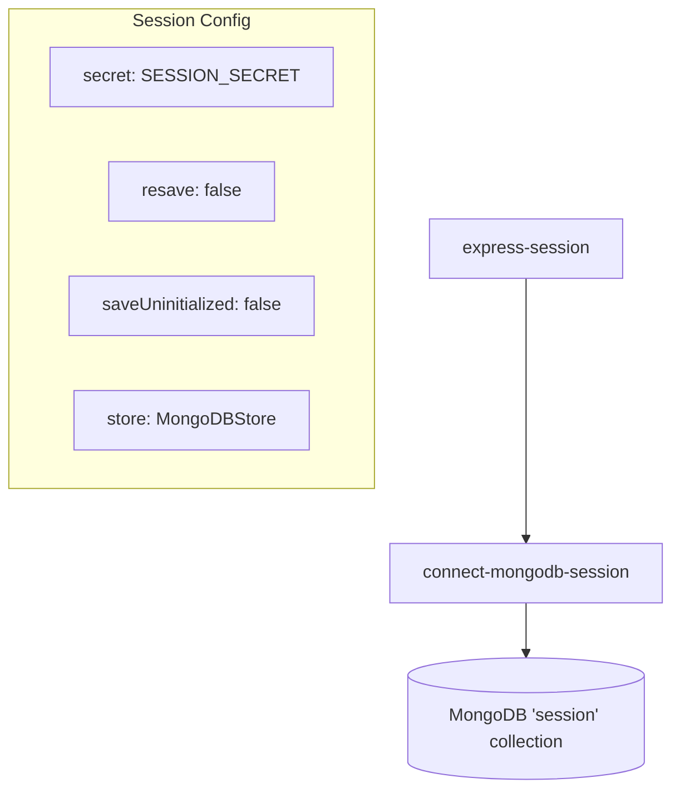
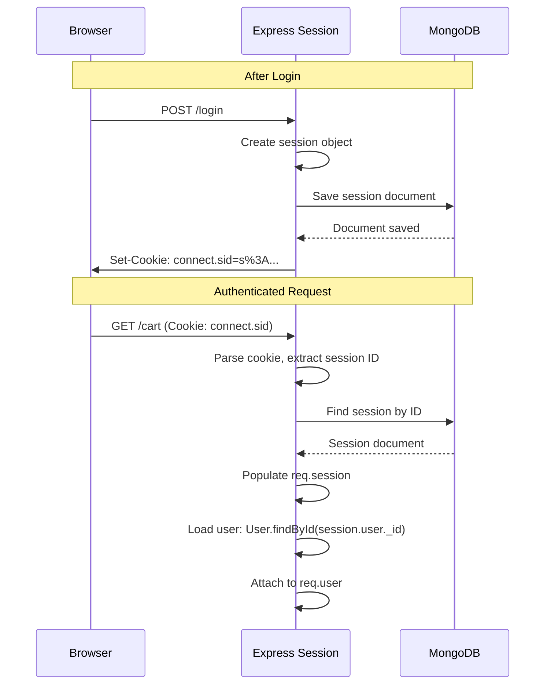
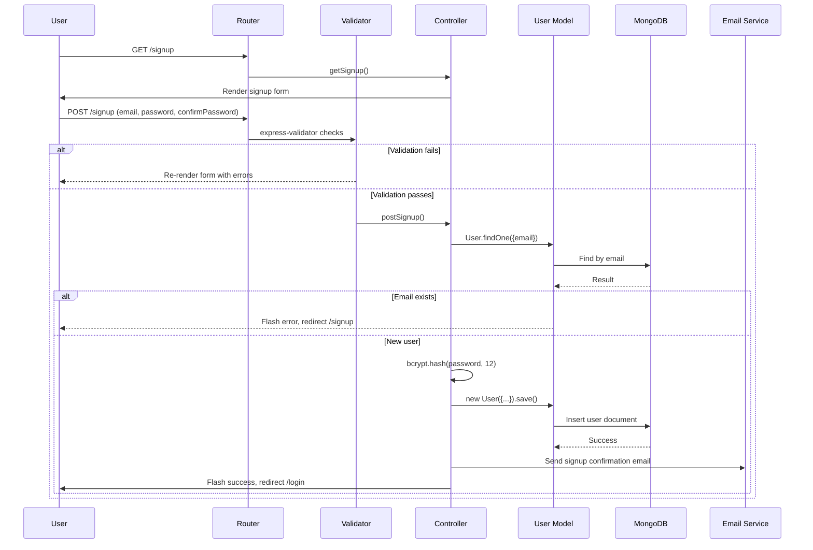
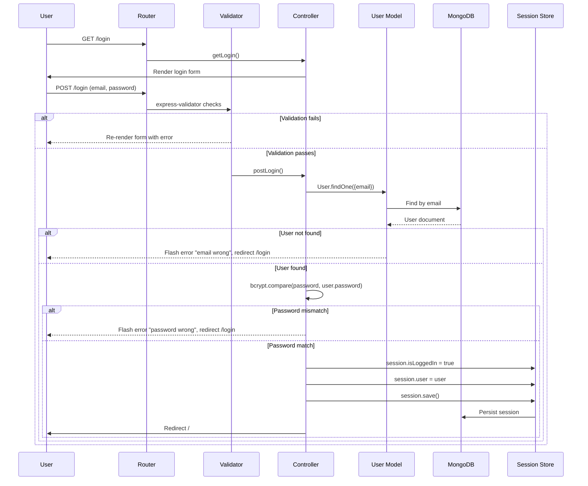
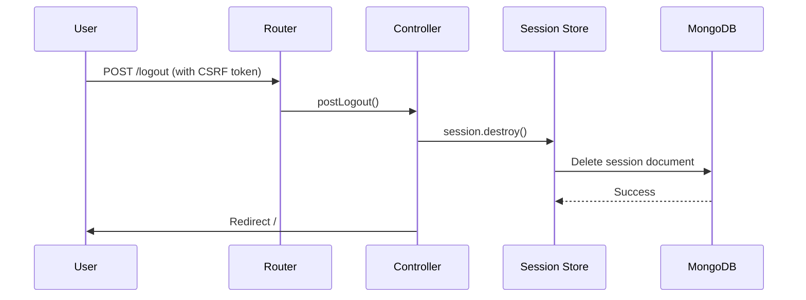
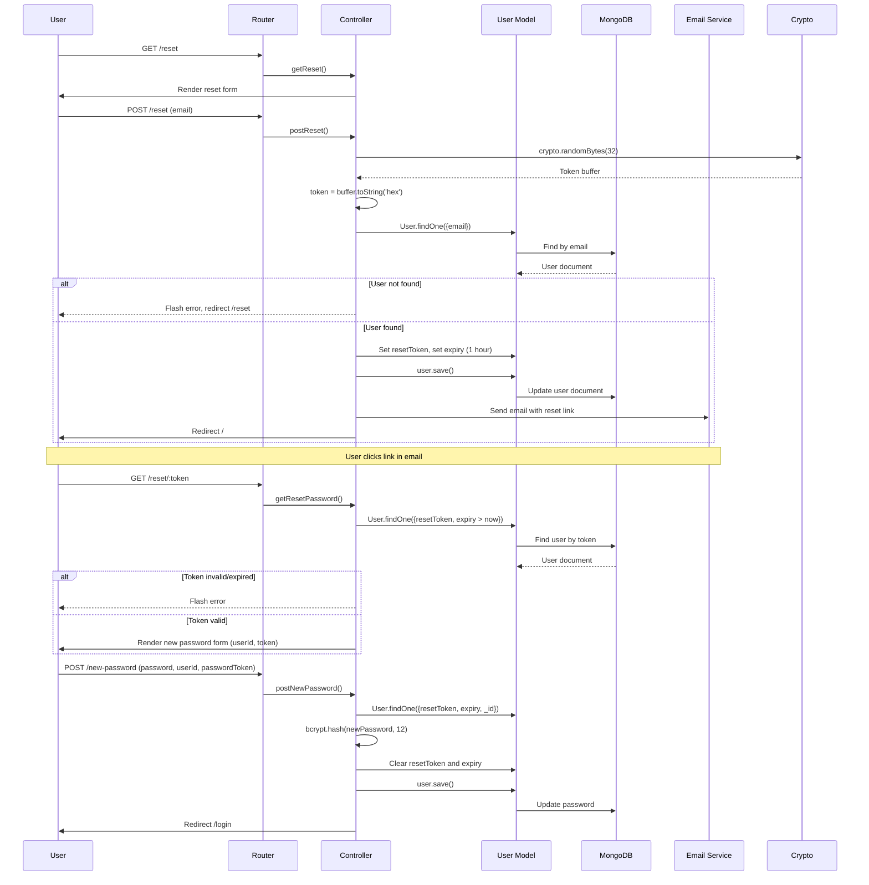

# Authentication

This document covers the authentication mechanism, session handling, and authorization patterns used in the NodeJS Shop application.

## Authentication Mechanism

The application uses **server-side session-based authentication** with:

- **Password Hashing**: bcryptjs with 12 salt rounds
- **Session Storage**: MongoDB via `connect-mongodb-session`
- **CSRF Protection**: csurf middleware

There is no JWT or token-based API authentication — all authentication is cookie-based session management.

## Password Hashing

Passwords are hashed using `bcryptjs` with **12 salt rounds**:

```javascript
// controllers/auth.js - postSignup
bcrypt.hash(password, 12).then(hashedPassword => {
    const user = new User({ password: hashedPassword, ... });
});
```

Password verification during login:

```javascript
// controllers/auth.js - postLogin
bcrypt.compare(password, user.password).then(isMatch => {
    if (isMatch) {
        req.session.isLoggedIn = true;
        req.session.user = user;
    }
});
```

## Session Configuration

### Setup (app.js)



### Session Data Structure

```javascript
{
    isLoggedIn: true,          // Boolean flag for auth state
    user: {                    // User object from MongoDB
        _id: ObjectId,
        email: String,
        name: String,
        password: String,      // Hashed password (included)
        cart: { items: [...] }
    }
}
```

### Session Flow



## Authorization Middleware

### is-auth.js

The authentication middleware at `middleware/is-auth.js`:

```javascript
module.exports = (req, res, next) => {
    if (!req.session.isLoggedIn) {
        return res.redirect('/login');
    }
    next();
}
```

### Protected Routes

The middleware is applied to:

| Route | Method | Purpose |
|-------|--------|---------|
| `/admin/add-product` | GET, POST | Admin product creation |
| `/admin/products` | GET | Admin product list |
| `/admin/edit-product/:productId` | GET | Admin product edit form |
| `/admin/edit-product` | POST | Admin product update |
| `/admin/product/:productId` | DELETE | Admin product deletion |
| `/checkout` | GET | Checkout page |
| `/PaymentRequest` | GET | Initiate payment |
| `/checkPayment` | GET | Payment verification callback |
| `/invoices/:orderId` | GET | Invoice PDF download |

### Ownership Checks

Beyond the `is-auth` middleware, certain operations verify resource ownership:

- **Product Edit** (`admin.js:182`): Checks `product.userId === req.user._id`
- **Product Delete** (`admin.js:216-219`): Filters by `userId` in the delete query
- **Invoice Download** (`shop.js:350`): Checks `order.user.userId === req.user._id`

## Signup Flow



### Validation Rules (routes/auth.js)

| Field | Rules |
|-------|-------|
| `email` | Must be valid email, normalized, not `test@gmail.com` |
| `password` | Minimum 5 characters, alphanumeric |
| `confimPassword` | Must match `password` |

## Login Flow



### Validation Rules (routes/auth.js)

| Field | Rules |
|-------|-------|
| `email` | Must be valid email, normalized |
| `password` | 5-25 characters, alphanumeric |

## Logout Flow



Logout destroys the session and redirects to the homepage. The session cookie expires.

## Password Reset Flow



### Token Details

- Generated using `crypto.randomBytes(32)` converted to hex
- Stored in `user.resetToken`
- Expires after 1 hour (`Date.now() + 3600000`)
- Expiry stored in `user.ExpiredDateresetToken`

## Authentication State in Views

Global template variables set by middleware (app.js:79-83):

```javascript
res.locals.isAuthenticated = req.session.isLoggedIn;  // Boolean
res.locals.csrfToken = req.csrfToken();               // CSRF token string
```

Used in EJS templates for conditional rendering:

```ejs
<% if(isAuthenticated) { %>
    <a href="/cart">Cart</a>
    <a href="/orders">Orders</a>
<% } else { %>
    <a href="/login">Login</a>
    <a href="/signup">Signup</a>
<% } %>
```

## Security Notes

- Sessions are stored in MongoDB (not in memory), surviving server restarts
- CSRF tokens are included in all forms and checked by csurf middleware
- Passwords are never stored in plain text
- The `is-auth` middleware provides route-level protection
- Ownership checks prevent users from modifying other users' products or viewing other users' invoices
- Flash messages provide user feedback without persisting sensitive data
