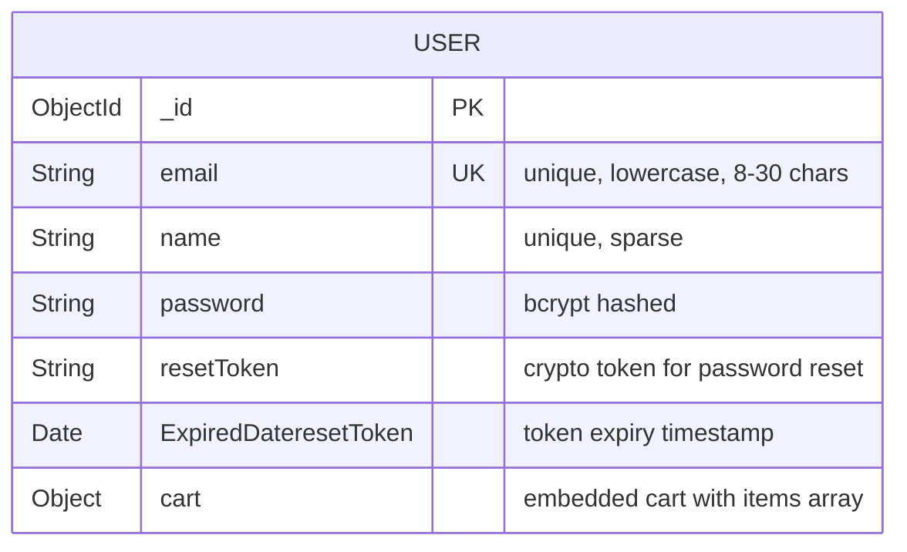
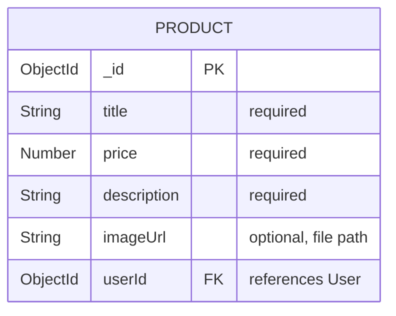
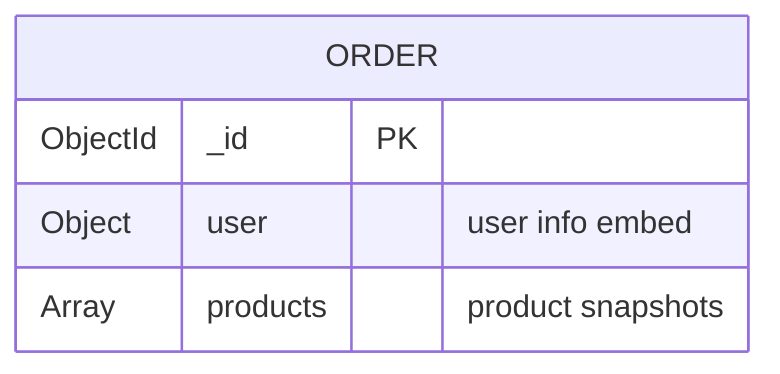
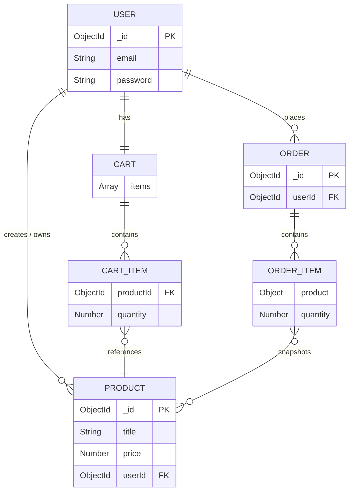

# Database

## Database Technology

- **Database**: MongoDB
- **ODM**: Mongoose 6.x
- **Connection**: Configured via `DATABASE_HOST` and `DATABASE_NAME` environment variables
- **Connection URI**: `mongodb://${DATABASE_HOST}/${DATABASE_NAME}`

### Connection Setup (app.js)

```javascript
const MONGODB_URI = `mongodb://${databaseHost}/${databaseName}`;

mongoose.connect(MONGODB_URI)
    .then(() => { app.listen(port); })
    .catch(err => { console.log(err); });
```

## Collections

The application uses four MongoDB collections:

| Collection | Purpose | Created By |
|------------|---------|------------|
| `users` | User accounts, credentials, and embedded carts | Mongoose `User` model |
| `products` | Product catalog with ownership | Mongoose `Product` model |
| `orders` | Order records with embedded product snapshots | Mongoose `Order` model |
| `session` | Express session storage | `connect-mongodb-session` |

## Schemas

### User Schema (`models/user.js`)



**Fields:**

| Field | Type | Required | Constraints |
|-------|------|----------|-------------|
| `email` | String | Yes | unique, lowercase, minlength: 8, maxlength: 30 |
| `name` | String | No | unique, sparse |
| `password` | String | Yes | bcrypt hashed |
| `resetToken` | String | No | Used for password reset |
| `ExpiredDateresetToken` | Date | No | Token expiry timestamp |
| `cart.items` | Array | Yes | Embedded array of cart items |

**Cart Items Subdocument:**

| Field | Type | Required | Reference |
|-------|------|----------|-----------|
| `productId` | ObjectId | Yes | References `Product` |
| `quantity` | Number | Yes | — |

**Instance Methods:**

| Method | Description |
|--------|-------------|
| `addTocart(product)` | Adds product to cart or increments quantity if already exists |
| `removeFromCart(productId)` | Removes item from cart by product ID |
| `clearCart()` | Empties the entire cart |

### Product Schema (`models/product.js`)



**Fields:**

| Field | Type | Required | Reference |
|-------|------|----------|-----------|
| `title` | String | Yes | — |
| `price` | Number | Yes | — |
| `description` | String | Yes | — |
| `imageUrl` | String | No | File path to uploaded image |
| `userId` | ObjectId | Yes | References `User` |

### Order Schema (`models/order.js`)



**Fields:**

| Field | Type | Required | Reference |
|-------|------|----------|-----------|
| `user.email` | String | Yes | — |
| `user.userId` | ObjectId | Yes | References `User` |
| `products` | Array | Yes | Embedded array of product snapshots |

**Order Products Subdocument:**

| Field | Type | Required |
|-------|------|----------|
| `product` | Object | Yes | Full product data snapshot |
| `quantity` | Number | Yes | — |

## Relationships



### Relationship Details

| Relationship | Type | Description |
|-------------|------|-------------|
| User → Products | One-to-Many | A user owns many products (admin) |
| User → Orders | One-to-Many | A user places many orders |
| User → Cart | One-to-One | Each user has one embedded cart |
| Order → Products | Embedded | Products are snapshotted in the order (denormalized) |
| Cart → Products | Reference | Cart items reference Product by ObjectId |
| Product → User | Reference | Products reference the creating user |

### Denormalization in Orders

Orders store a **snapshot** of product data rather than referencing the Product collection:

```javascript
// From controllers/shop.js - postOrder
const products = user.cart.items.map((i) => {
    return {
        quantity: i.quantity,
        product: { ...i.productId._doc },  // Full product snapshot
    };
});
const order = new Order({ user: { email, userId }, products });
```

This ensures order records remain intact even if the original product is edited or deleted.

## Indexes

The following indexes are defined by schema constraints:

| Collection | Field | Index Type | Purpose |
|------------|-------|------------|---------|
| `users` | `email` | Unique | Prevent duplicate registrations |
| `users` | `name` | Unique (sparse) | Optional unique name field |
| `session` | `_id` | Default | Session lookup by ID |

No additional custom indexes are defined in the current codebase. The `products` collection does not have explicit indexes on `userId`, though queries filter by it.

## Mongoose Population

The application uses `populate()` for resolving references:

```javascript
// Shop controller - get cart
const user = await req.user.populate('cart.items.productId');

// Shop controller - get orders
Order.find({ 'user.userId': req.user._id })
```

Populated fields resolve ObjectId references to full documents at query time.
