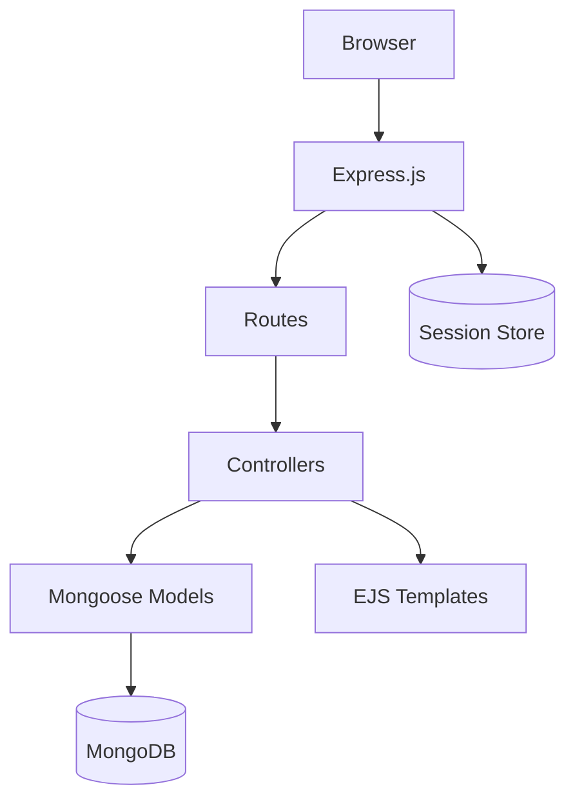

# NodeJS Shop Documentation

Welcome to the NodeJS Shop documentation. This is a full-featured e-commerce application built with Node.js, Express.js, and MongoDB.

## Table of Contents

### Getting Started

- [Installation Guide](../README.md) — Setup and run the application
- [Environment Variables](environment.md) — Configuration reference
- [Developer Guide](developer-guide.md) — Onboarding and development workflow

### Architecture & Design

- [Project Structure](project-structure.md) — Directory layout and responsibilities
- [Architecture](architecture.md) — System architecture and patterns
- [Database](database.md) — Schemas, relationships, and indexes

### Features & Flows

- [Authentication](authentication.md) — Auth mechanism and session management
- [Request Flow](request-flow.md) — Step-by-step user action flows
- [API Reference](api-reference.md) — Complete route reference

### Operations

- [Deployment Guide](deployment.md) — Production deployment
- [Security Analysis](security.md) — Security review and recommendations

## Quick Links

| Document | Description |
|----------|-------------|
| [Architecture](architecture.md) | MVC pattern, request lifecycle, session management |
| [Authentication](authentication.md) | Signup, login, logout, password reset flows |
| [Database](database.md) | User, Product, Order schemas and relationships |
| [Request Flow](request-flow.md) | Detailed flow for each user action |
| [API Reference](api-reference.md) | All routes with methods, middleware, and validation |
| [Security](security.md) | CSRF, session security, password hashing analysis |
| [Deployment](deployment.md) | Production setup, Nginx, PM2, security hardening |
| [Developer Guide](developer-guide.md) | Local setup, coding conventions, debugging |
| [Environment](environment.md) | Environment variable reference |
| [Project Structure](project-structure.md) | Directory responsibilities |

## Tech Stack Summary

- **Runtime**: Node.js
- **Framework**: Express.js 4.x
- **Database**: MongoDB with Mongoose 6.x
- **Templates**: EJS (server-side rendering)
- **Authentication**: bcryptjs + express-session
- **Payment**: Zarinpal Gateway
- **PDF**: PDFKit
- **Email**: Nodemailer

## Architecture Overview

## License

ISC
