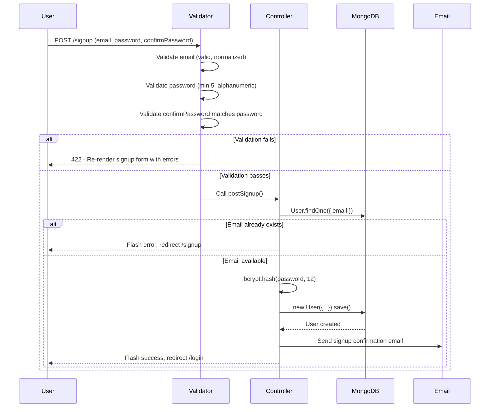
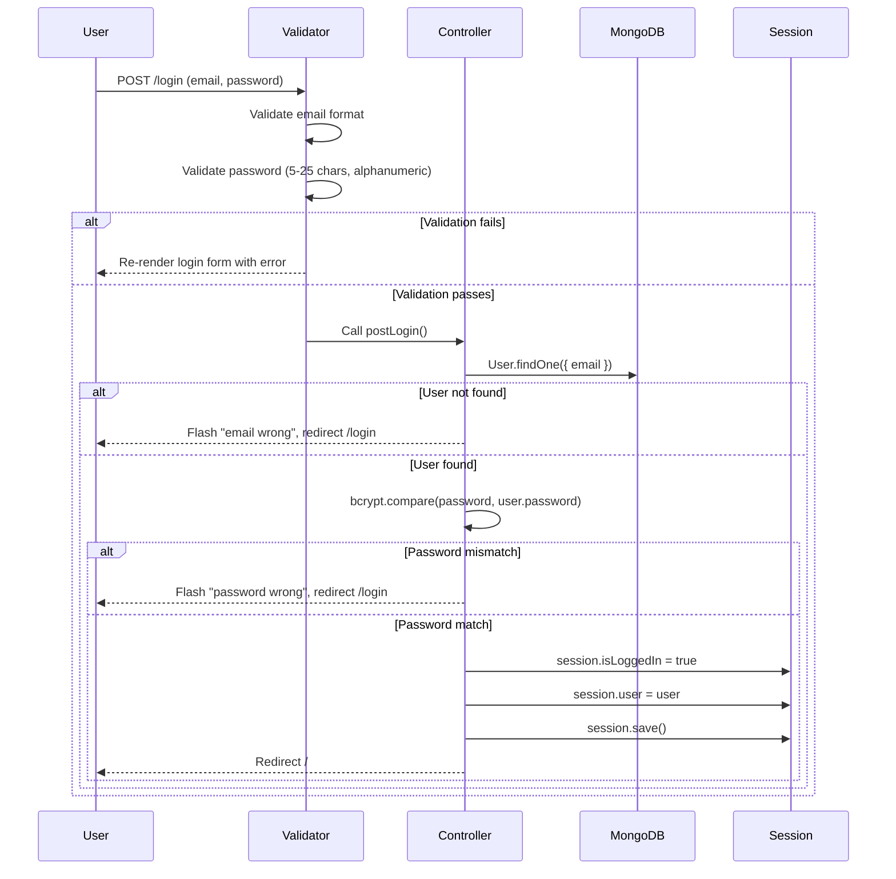
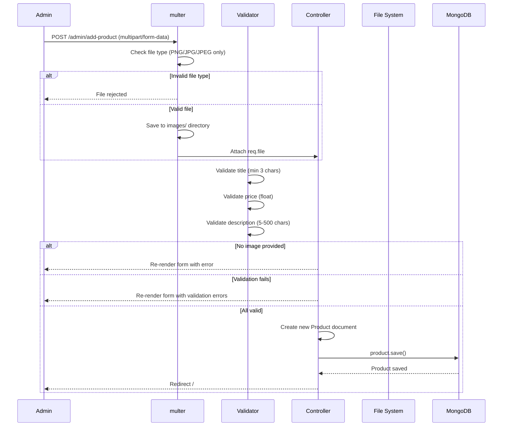
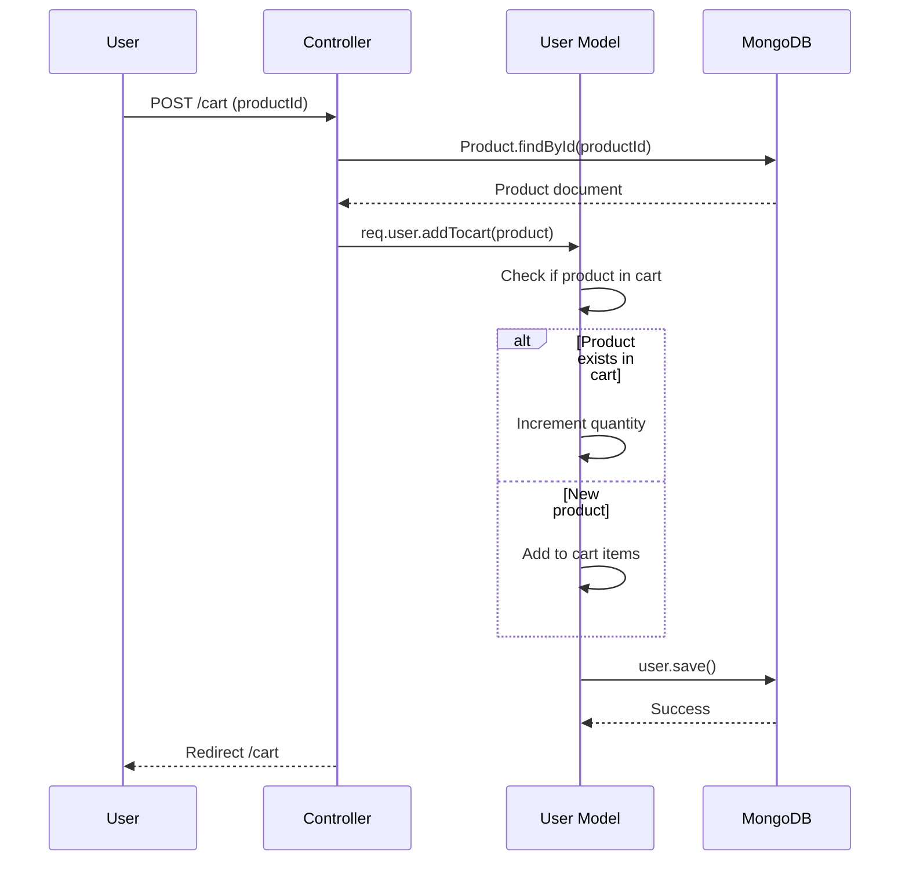
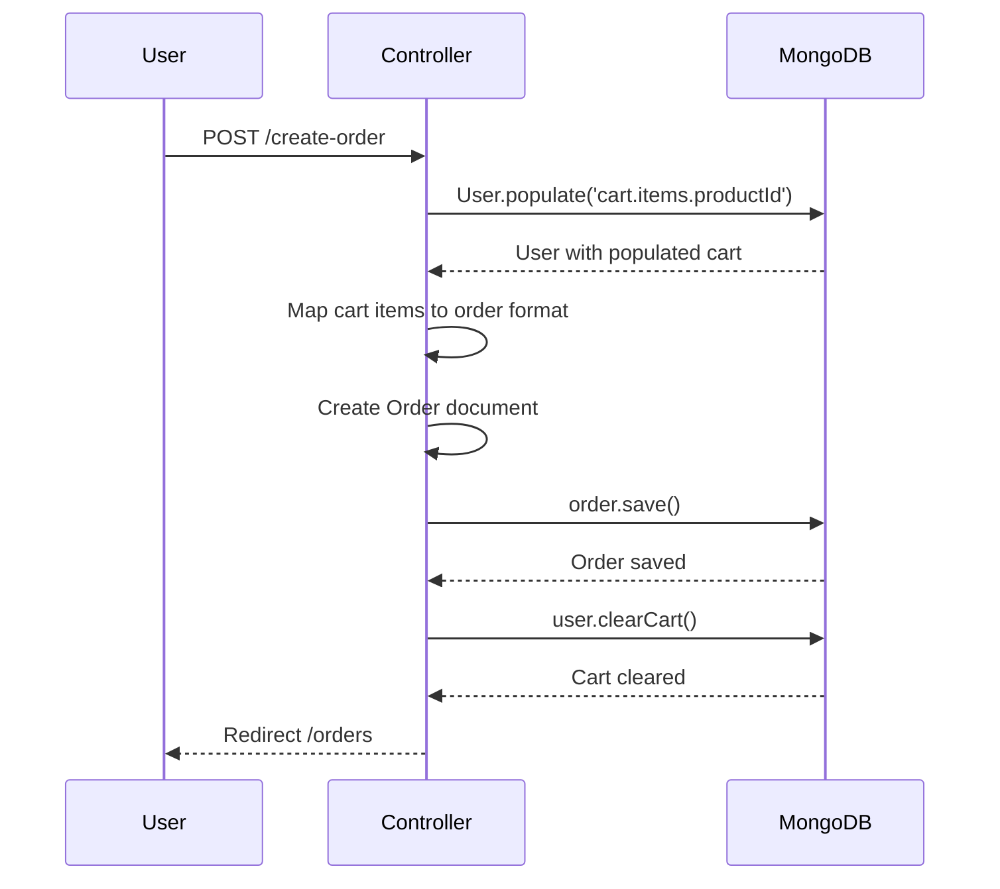
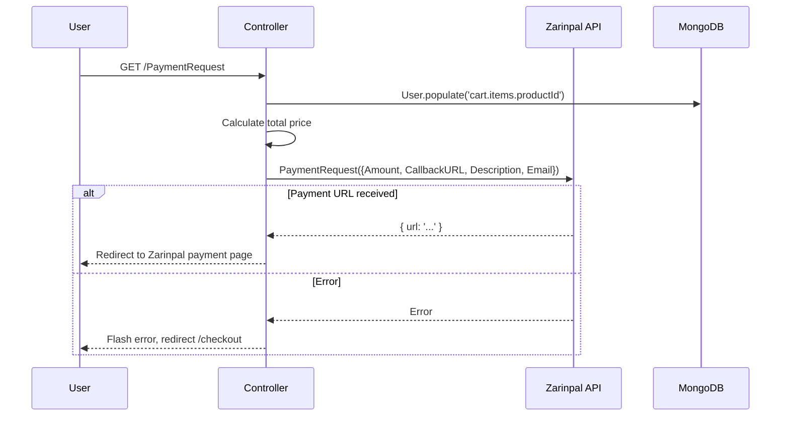
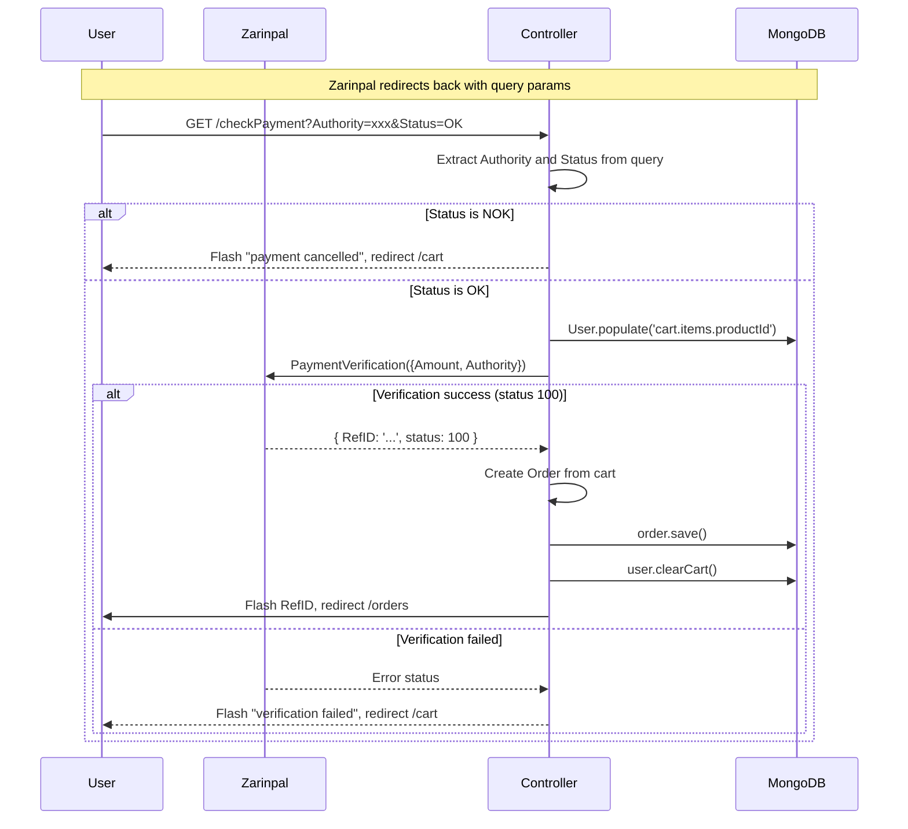
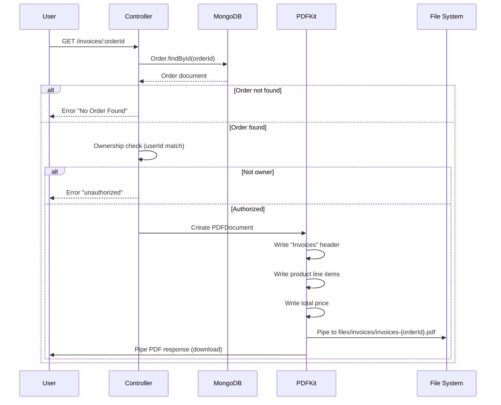

# Request Flow

This document describes the step-by-step request flow for each major user action in the application.

## User Registration

**Route**: `POST /signup`  
**Controller**: `auth.js` → `postSignup`  
**Validation**: `routes/auth.js` (express-validator)

### Steps

1. User submits signup form with email, password, and confirm password
2. `express-validator` validates email format, password length/characters, and password match
3. If validation fails, form re-renders with error messages
4. Controller checks if email already exists in database
5. If email exists, flash error and redirect to signup
6. Password is hashed with bcrypt (12 rounds)
7. New user document is created with empty cart
8. Confirmation email is sent via Nodemailer
9. User is redirected to login page with success flash message

## User Login

**Route**: `POST /login`  
**Controller**: `auth.js` → `postLogin`  
**Validation**: `routes/auth.js` (express-validator)

### Steps

1. User submits login form with email and password
2. Validator checks email format and password constraints
3. Controller queries database for user by email
4. If user not found, flash error and redirect
5. If user found, compare password with bcrypt
6. If password mismatch, flash error and redirect
7. If password matches, set `session.isLoggedIn = true` and `session.user = user`
8. Save session to MongoDB store
9. Redirect to homepage

## Product Creation (Admin)

**Route**: `POST /admin/add-product`  
**Controller**: `admin.js` → `postAddProduct`  
**Middleware**: `is-auth` (authentication required)

### Steps

1. Admin submits product form with title, price, description, and image
2. Multer processes the multipart form data
3. File type is filtered — only PNG, JPG, JPEG accepted
4. File is saved to `images/` directory with timestamp prefix
5. express-validator validates title (min 3), price (float), description (5-500 chars)
6. If no image is provided, form re-renders with error
7. If validation fails, form re-renders with errors
8. New Product document is created with image path and user reference
9. Product is saved to MongoDB
10. Admin is redirected to homepage

## Product Editing (Admin)

**Route**: `POST /admin/edit-product`  
**Controller**: `admin.js` → `postEditProduct`  
**Middleware**: `is-auth`

### Steps

1. Admin submits edited product form
2. Validator checks title, price, description
3. Controller finds product by ID
4. **Ownership check**: verifies `product.userId === req.user._id`
5. If new image uploaded, old image file is deleted via `fileHelper.deleteFile()`
6. Product fields are updated
7. Product is saved to MongoDB
8. Admin is redirected to homepage

## Add To Cart

**Route**: `POST /cart`  
**Controller**: `shop.js` → `postCart`

### Steps

1. User clicks add-to-cart button (contains `productId`)
2. Controller finds product by ID from request body
3. Calls `req.user.addTocart(product)` (User model method)
4. `addTocart` checks if product already exists in cart:
   - **Yes**: Increments quantity by 1
   - **No**: Adds new item with quantity 1
5. User document is saved with updated cart
6. User is redirected to cart page

## Remove From Cart

**Route**: `POST /cart-delete-item`  
**Controller**: `shop.js` → `postCartDeleteProduct`

### Steps

1. User clicks delete button on cart item (contains `productId`)
2. Calls `req.user.removeFromCart(productId)`
3. `removeFromCart` filters out the item with matching productId
4. User document is saved with updated cart
5. User is redirected to cart page

## Create Order

**Route**: `POST /create-order`  
**Controller**: `shop.js` → `postOrder`

### Steps

1. User submits order from cart page
2. Controller populates cart items with product details
3. Cart items are mapped to order product format:
   - Product snapshot (full product data spread)
   - Quantity
4. New Order document is created with:
   - User email and userId
   - Products array with snapshots
5. Order is saved to MongoDB
6. `req.user.clearCart()` is called — empties cart
7. User is redirected to orders page

## Payment Process (Zarinpal)

### Step 1: Initiate Payment

**Route**: `GET /PaymentRequest`  
**Controller**: `shop.js` → `getPayment`  
**Middleware**: `is-auth`

### Step 2: Verify Payment

**Route**: `GET /checkPayment`  
**Controller**: `shop.js` → `checkPayment`  
**Middleware**: `is-auth`

### Payment Flow Summary

1. User clicks "Pay" on checkout page
2. Server calculates total price from cart
3. Zarinpal `PaymentRequest` API is called with amount, callback URL, description
4. User is redirected to Zarinpal payment page
5. User completes payment on Zarinpal
6. Zarinpal redirects to `/checkPayment?Authority=xxx&Status=OK`
7. Server verifies payment via Zarinpal `PaymentVerification` API
8. If verified (status 100):
   - Order is created with product snapshots
   - Cart is cleared
   - RefID is displayed to user
9. If not verified, user is redirected with error

## Invoice Generation

**Route**: `GET /invoices/:orderId`  
**Controller**: `shop.js` → `getInvoices`  
**Middleware**: `is-auth`

### Steps

1. User clicks invoice download link
2. Controller finds order by ID
3. **Ownership check**: verifies `order.user.userId === req.user._id`
4. PDF document is created with PDFKit
5. Header "Invoices" is written
6. Each product line is written with quantity and price
7. Total price is calculated and written
8. PDF is piped to both:
   - File system: `files/invoices/invoices-{orderId}.pdf`
   - HTTP response: `Content-Type: application/pdf`
9. Browser downloads the PDF file
